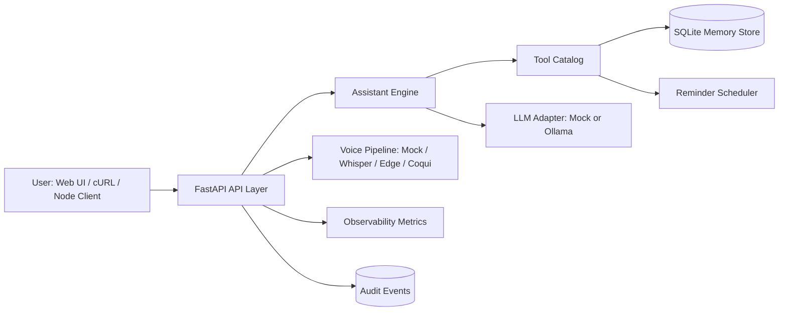

# ai-personal-assistant

Production-grade AI personal assistant.

This project demonstrates fast execution across backend, AI orchestration, observability, deployment, and product UX while protecting private startup IP.

This repository is a public showcase version. Advanced production modules remain private.

## Why This Project Matters

- Demonstrates real AI assistant workflows, not toy prompts
- Shows startup-ready shipping ability: API + dashboard + Docker + CI
- Includes observability, test coverage, and optional auth hardening
- Supports polyglot adaptability with Python backend and Node.js client

## Core Capabilities

- FastAPI backend with clean modular structure
- Assistant engine with intent routing and tool orchestration
- SQLite memory layer (messages, notes, tasks, reminders, facts, events)
- Reminder scheduler with persistence and startup rehydration
- LLM abstraction layer (`mock` or optional `ollama`)
- Voice pipeline with optional real adapters (Whisper STT, Edge/Coqui TTS)
- Built-in observability summary (errors, tool usage, response timings, system health)
- Lightweight web dashboard at `/ui`

## Architecture Diagram



## Project Structure

```text
ai-assist/
├── src/
│   ├── api/              # FastAPI routes, middleware, optional token auth
│   ├── assistant/        # Prompting + orchestration + LLM abstraction
│   ├── memory/           # SQLite schema and domain store
│   ├── observability/    # Request metrics and runtime summaries
│   ├── scheduler/        # Reminder scheduler
│   ├── tools/            # Safe tool execution catalog
│   ├── voice/            # Mock + optional real voice adapters
│   └── utils/            # Logging utilities
├── node_client/          # Node.js integration signal
├── tests/                # Pytest suite
├── Dockerfile
├── docker-compose.yml
└── .github/workflows/ci.yml
```

## Local Setup

```bash
python -m venv .venv
.venv\Scripts\activate
pip install -r requirements.txt
copy .env.example .env
```

Run API:

```bash
python -m src.main serve
```

Key URLs:

- `http://127.0.0.1:8001/docs`
- `http://127.0.0.1:8001/health`
- `http://127.0.0.1:8001/ui`

## Docker Quickstart

Build and run:

```bash
docker compose up --build
```

Stop:

```bash
docker compose down
```

Production-style notes:

- App data persisted through mounted `./data` volume
- Logs persisted through mounted `./logs` volume
- Healthcheck included in container image

## Node.js Integration Example

The `node_client` folder demonstrates Python + Node interoperability.

```bash
cd node_client
npm install
npm run start
npm run chat
npm run reminder
```

Optional env variables:

- `SHOWCASE_API_URL`
- `SHOWCASE_API_TOKEN`

## Voice AI Optional Mode

Default mode is mock voice for easy onboarding.

To enable real voice dependencies:

```bash
pip install -r requirements-voice.txt
```

Config options in `.env`:

- `SHOWCASE_VOICE_STT_PROVIDER=mock|whisper`
- `SHOWCASE_VOICE_TTS_PROVIDER=mock|edge|coqui`

Endpoints:

- `POST /voice/transcribe` (audio path + provider)
- `POST /voice/speak` (text + provider)
- `GET /voice/capabilities`

## Observability Upgrade

New endpoint:

- `GET /observability/summary`

Includes:

- Recent actions and errors
- Tool usage counts
- Assistant response timing (`avg`, `p95`)
- Request latency by path
- CPU and memory health metrics

## Optional Token Auth (Demo Hardening)

Set:

```bash
SHOWCASE_API_TOKEN=your-demo-token
```

Then include header for protected endpoints:

```text
x-api-token: your-demo-token
```

## API Examples

Chat:

```bash
curl -X POST http://127.0.0.1:8001/chat ^
  -H "Content-Type: application/json" ^
  -d "{\"message\":\"Add a task: prepare for AI startup interview\"}"
```

Reminder:

```bash
curl -X POST http://127.0.0.1:8001/reminders ^
  -H "Content-Type: application/json" ^
  -d "{\"message\":\"Follow up with recruiter\",\"minutes\":20}"
```

Observability:

```bash
curl http://127.0.0.1:8001/observability/summary
```

## Test and CI

Run tests locally:

```bash
python -m pytest
```

GitHub Actions pipeline in `.github/workflows/ci.yml` runs:

- Python tests
- Docker image build validation

## Screenshot Checklist for GitHub

Add these screenshots under `assets/screenshots/`:

- `dashboard-overview.png` (show `/ui` full page)
- `chat-flow.png` (NL command to tool execution)
- `observability-summary.png` (metrics and tool usage)
- `docker-run.png` (container startup + health endpoint)
- `node-client-demo.png` (Node script calling FastAPI)

## Recruiter Talking Points

- Designed for startup speed: modular features shipped with clear boundaries
- Practical AI stack: intent routing, tool orchestration, provider abstraction
- Production signals: Docker, CI, observability, optional auth
- Polyglot adaptability: Node.js client consuming Python API
- Confidentiality-aware engineering: public-safe architecture, private moat protected

## Confidentiality Note

This repository is a public showcase version. Advanced production modules remain private.
